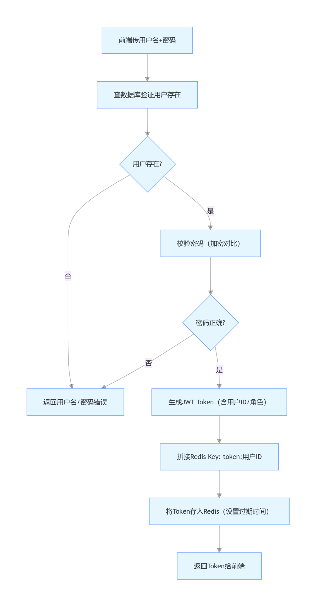

# 核心注解：@SpringBootApplication
本质：@SpringBootApplication = @Configuration + @EnableAutoConfiguration + @ComponentScan；
关键作用：
@ComponentScan：扫描当前包（com.example.audiobackend）及其子包下的所有 Spring 组件（@RestController/@Service/@Component等），并创建对象；
@EnableAutoConfiguration：自动配置 Spring Boot（比如自动配置 Tomcat 端口、JSON 解析、Web 环境等），不用手动写配置文件；
@Configuration：标记这是配置类，允许自定义配置。


启动类初始化 Spring 框架
找所有带 @RestController/@Service 等注解的类
把这些类放进spring容器里

SpringApplication.run(...) 执行时，会：
加载所有自动配置类（包括 Tomcat 的）；
调用 Tomcat 的启动方法，绑定 8080 端口；
让 Tomcat 进入 “监听状态”，等待浏览器请求。
 @GetMapping("/hello")类似一个监听器，当浏览器访问 /hello 时，会调用 sayHello() 方法。

 @RequestMapping("/api/product")
 这个是父路径，相当于文件夹
 @GetMapping("/list")
 这个是子路径，相当于文件
 这两者组合在一起，就相当于访问 /api/product/list，给服务器发送一个请求，服务器会调用 ProductController 类的 list() 方法，返回产品列表。

 /api 开头 = 纯数据接口（返回 JSON），给前端 / APP / 小程序调用；
 非 /api 开头 = 页面路径（返回 HTML），比如 /product/detail 是产品详情页。
 
@RestController 注解的类，默认返回 JSON 数据；
@Controller 注解的类，默认返回 HTML 页面。

## Spring流程
Spring 启动 → 打开“智能储物箱”（容器）
→ 扫描所有贴了@Configuration的类（找“造对象的说明书”）
→ 用反射读取类里贴了@Bean的方法（找“造对象的步骤”）
→ 执行@Bean方法，创建对象（按步骤造物品）
→ 把对象放进“储物箱”（容器），给对象起个名字（默认是方法名）
→ 其他类需要这个对象时，@Autowired直接从“储物箱”里拿（不用自己new）
→ 应用关闭时，Spring把“储物箱”里的对象销毁（执行destroyMethod）


# 后端整体结构
!----------------------------------!后端整体结构
com.example.audiobackend/
├── AudiobackendApplication.java  // 项目“总开关”：启动整个后端程序
├── common/                       // 通用工具包：全项目都能用的公共代码（比如返回结果、异常处理）
├── entity/                       // 实体包：描述“数据长什么样”（比如产品有ID、名称、价格）
├── service/                      // 服务包：核心业务逻辑（比如怎么查产品、怎么加产品）
│   └── impl/                     // 服务实现包：具体的业务逻辑代码
└── controller/                   // 控制器包：对接前端（接收前端请求，返回数据）

# 流程
前端请求先到Controller层，Controller不写业务逻辑，只调用Service层；
Controller通过@Autowired从 Spring 容器中取ProductServiceImpl对象（不用手动new）；
Service层处理核心业务（查列表），返回数据给Controller；
Controller用Result封装成统一格式的 JSON，返回给前端。


！lombok!
lombok 是一个 Java 库，它可以自动生成一些常用的代码，比如 getter/setter、toString、equals 等。
为什么用 Lombok？→ 企业开发效率工具，减少 80% 的重复代码（面试会问）。
# Spring Boot实体类核心注解 & 构造方法笔记
## Bean 是 Spring 容器中创建、管理、维护的所有 Java 对象的统称—— 
你可以把 Spring 容器想象成一个「智能工厂」，Bean 就是这个工厂里生产出来的「成品对象」
## 一、核心注解（Lombok）
### 1. 基础认知
Lombok是企业级开发必备效率工具，核心作用是**自动生成重复代码**（如getter/setter、构造方法），减少80%冗余代码，面试高频考点。

### 2. 三大核心注解（实体类标配）
| 注解                | 生成内容                          | 使用者       | 核心用途                                  | 类比（造电脑）                          |
|---------------------|-----------------------------------|--------------|-------------------------------------------|-----------------------------------------|
| `@Data`             | getter/setter、toString、equals等 | 开发者+Spring | 1. 开发者：获取/修改对象属性（如`p.getName()`）；<br>2. Spring：通过setter给对象赋值 | 电脑的“配件安装接口”（能装/拆配件）|
| `@NoArgsConstructor` | 无参构造方法（`public Product(){}`） | Spring框架   | 给Spring提供“创建对象的入口”，**必须有**；<br>无此注解Spring无法创建对象，项目启动失败 | 空电脑机箱（无机箱，后续装配件都免谈） |
| `@AllArgsConstructor` | 全参构造方法（含所有属性）| 开发者       | 快速创建“有完整属性值”的对象，提升开发效率 | 预装所有配件的成品电脑（不用逐件装）|

## 二、构造方法深度理解
### 1. 无参构造（Spring的“刚需”）
- **底层逻辑**：Spring创建对象时，优先调用无参构造生成“空对象”，再通过`@Data`生成的setter方法逐属性赋值。
- **反例后果**：无无参构造时，Spring抛出`No default constructor found`异常，无法创建对象。
- **手写等价代码**：
  ```java
  public Product() {
  }
  ```

### 2. 全参构造（开发者的“便利工具”）
- **核心场景**：
  ① 初始化模拟数据（一行创建有完整数据的对象）；
  ② 封装前端传参（快速把参数转为实体对象）；
  ③ 测试代码（简化对象创建流程）。
- **有无对比**：
  ```java
  // 无全参构造（繁琐）
  Product p = new Product();
  p.setId(1L);
  p.setName("家庭影院音响");
  p.setPrice(1999.99);

  // 有全参构造（简洁）
  Product p = new Product(1L, "家庭影院音响", 1999.99, "5.1声道", "/img/1.jpg");
  ```
- **手写等价代码**：
  ```java
  public Product(Long id, String name, Double price, String description, String imageUrl) {
      this.id = id;
      this.name = name;
      this.price = price;
      this.description = description;
      this.imageUrl = imageUrl;
  }
  ```

## 三、企业级实体类标准写法（面试加分）
```java
package com.example.audiobackend.entity;

import lombok.AllArgsConstructor;
import lombok.Data;
import lombok.NoArgsConstructor;

// 三大注解组合：满足Spring规则 + 提升开发效率
@Data
@NoArgsConstructor
@AllArgsConstructor
public class Product {
    // 核心属性（贴合业务场景）
    private Long id;          // 产品ID（Long适配大数值主键）
    private String name;      // 产品名称
    private Double price;     // 产品价格（支持小数）
    private String description; // 产品描述
    private String imageUrl;  // 产品图片路径
}
```

## 四、关键考点（面试必答）
当你点击 “编译 / 运行” 时，Lombok 作为 Java 编译器的「插件」，会先扫描代码：
发现Product类上有@Data标签 → 触发 Lombok 的处理逻辑。
1. `@NoArgsConstructor`的作用？  
   生成无参构造方法，满足Spring创建对象的规则，是实体类必须注解。
2. 为什么要用Lombok？  
   减少重复代码（getter/setter/构造方法），提升开发效率，符合企业开发规范。
3. 无参构造和全参构造的分工？  
   无参构造给Spring用（创建对象入口），全参构造给开发者用（快速创建有数据的对象），两者分工协作。package com.example.audiobackend.entity;

import lombok.AllArgsConstructor;
import lombok.Data;
import lombok.NoArgsConstructor;

// 三大注解组合：满足Spring规则 + 提升开发效率
@Data
@NoArgsConstructor
@AllArgsConstructor
public class Product {
    // 核心属性（贴合业务场景）
    private Long id;          // 产品ID（Long适配大数值主键）
    private String name;      // 产品名称
    private Double price;     // 产品价格（支持小数）
    private String description; // 产品描述
    private String imageUrl;  // 产品图片路径
}


# @Service 注解（核心）
作用：告诉 Spring“这个类是服务层组件，我要创建这个类的对象，并放到 Spring 容器中管理”；
运行逻辑：Spring 启动时扫描到@Service → 创建ProductServiceImpl对象 → 后续Controller层用@Autowired就能直接取这个对象用；
对比：和@RestController一样，都是 Spring 的 “组件注解”，只是分工不同（@Service标记服务层，@RestController标记控制器层）
业务逻辑封装：所有产品的增删改查逻辑都集中在这里，控制器层只负责 “接请求、返结果”，不写业务逻辑（符合 “单一职责原则”）；
便于扩展：后续要对接 MySQL，只需要修改ProductServiceImpl的方法实现，控制器层不用改一行代码；
面试重点：面试官会重点问 Service 层的业务逻辑设计、接口和实现的分工。


# 流式编程（stream ()）
作用：简化集合操作（遍历、过滤、查找），代码更简洁；
核心方法：
- `filter()`：过滤集合元素，保留符合条件的元素；
- `map()`：对集合元素进行映射操作，返回新的元素；
- `collect()`：将流元素收集到集合中，常用Collectors.toList()或Collectors.toSet()；
- `forEach()`：对流元素进行遍历操作，常用在打印或简单处理元素上。   


# mysql
## 简单说：用 MyBatis-Plus（简化数据库操作的工具）替代 List，让代码直接和 MySQL 对话。
## 连接配置
在 application.properties 中配置数据库连接信息（URL、用户名、密码、驱动类），Spring Boot 会自动读取这些配置，建立与 MySQL 的连接。
```properties
spring.datasource.url=jdbc:mysql://localhost:3306/audio_db?useUnicode=true&characterEncoding=utf8mb4&useSSL=false&serverTimezone=Asia/Shanghai
spring.datasource.username=root
spring.datasource.password=Zou1218yu
spring.datasource.driver-class-name=com.mysql.cj.jdbc.Driver
```
## MyBatis-Plus 配置
在 application.properties 中配置 MyBatis-Plus 的相关信息（Mapper 位置、实体类包名），MyBatis-Plus 会根据这些配置自动扫描 Mapper 接口和实体类。
```properties
# MyBatis-Plus 配置
mybatis-plus.mapper-locations=classpath:mapper/*.xml
mybatis-plus.type-aliases-package=com.example.audiobackend.entity
```

// 注意：Java 用驼峰，MyBatis-Plus 会自动映射到数据库的 image_url
## mybatis-plus 自动映射规则
- Java 用驼峰，MyBatis-Plus 会自动映射到数据库的下划线命名
- 数据库用下划线，MyBatis-Plus 会自动映射到 Java 的驼峰命名
### 作用
- 简化数据库操作：MyBatis-Plus 提供了大量的 CRUD 方法，开发者无需编写 SQL 语句，直接调用接口方法即可完成数据库操作。
- 不用手写基础 SQL：你不用写「查所有产品、按 id 查、新增、修改、删除」的 SQL，MP 的 BaseMapper 已经封装好了这些操作：
selectList(null) → 自动生成 SELECT * FROM product
selectById(1) → 自动生成 SELECT * FROM product WHERE id = 1
insert(product) → 自动生成 INSERT INTO product(...) VALUES (...)
简化代码：原来你需要写几十行流式遍历 List 的代码，现在一行 productMapper.selectList(null) 就搞定；
降低出错概率：手写 SQL 容易写错字段名、语法，MP 自动生成的 SQL 不会错；
提高开发效率：你不用花时间写重复的 CRUD SQL，专注业务逻辑即可。
## CRUD (Create, Read, Update, Delete)操作
### 由于mybatis-plus 不适配spring boot 4.x，所以这里用mybatis，手动写sql语句

### JDBC 驱动只识别 characterEncoding=utf8，不支持 utf8mb4（但 utf8 参数会自动适配 MySQL 的 utf8mb4 编码，不影响中文 / 特殊字符存储）；


# !!!!!!!
太开心了，现在这个配置是超级无敌终极方案，不会不兼容


# ProductController
## 1.Controller 设计原则
不写业务逻辑：所有数据库交互（查 / 增 / 改 / 删）交给 productService（服务层）；
统一返回格式：所有接口返回 Result 类型（包含 code/msg/data），前端解析更规范；
路径命名规范：动态参数加前缀（如 /get/{id}/delete/{id}），避免路径冲突。

## @Autowired：
无需手动 new 对象，Spring 自动匹配 ProductService 接口的实现类（ProductServiceImpl）并赋值；
作用：Controller 可直接调用 productService 的方法（如 list()/add()），无需关心底层实现细节（如数据库操作）。
### 原理：Spring 执行 @Autowired 的完整逻辑如下：
必须先懂「Spring 容器」：
Spring 启动时，会扫描项目中所有加了特定注解的类（如 @Service/@Controller/@Repository/@Component），并自动创建这些类的实例对象，把这些对象统一管理起来，这个「对象仓库」就是「Spring 容器」；
比如你写的 ProductServiceImpl 加了 @Service，Spring 会自动创建 ProductServiceImpl 对象，并存到容器中。

步骤 1：识别注入目标
Spring 看到 @Autowired 注解后，先确定「要注入什么类型的对象」—— 这里变量的类型是 ProductService（接口），所以目标是「找一个 ProductService 类型的对象」。

步骤 2：从容器中查找匹配的对象
Spring 会按「类型优先」的规则，在容器中找符合条件的对象，查找优先级：
按类型匹配：先找容器中所有「实现了 ProductService 接口」的对象（比如你的 ProductServiceImpl 实现了该接口，且加了 @Service，已经被 Spring 创建并存入容器）；
类型唯一则直接注入：如果容器中只有一个 ProductService 类型的对象（比如只有 ProductServiceImpl 这一个实现类），直接把这个对象赋值给 productService 变量；
类型不唯一则按名称匹配：如果有多个实现类（比如 ProductServiceImpl1/ProductServiceImpl2），Spring 会再按「变量名」匹配（比如变量名是 productService，就找容器中名称为 productService 的对象）；
匹配不到则报错：如果既没找到类型匹配的，也没找到名称匹配的，会抛出 NoSuchBeanDefinitionException（找不到 Bean 异常）。

步骤 3：赋值给变量
找到匹配的对象后，Spring 会自动把这个对象赋值给 productService 变量 —— 此时你在 Controller 中直接调用 productService.list()，实际调用的是容器中 ProductServiceImpl 对象的 list() 方法。

步骤 4：支持「依赖传递」
如果 ProductServiceImpl 中也有 @Autowired 注解（比如注入 ProductMapper），Spring 会先创建 ProductMapper 对象，再创建 ProductServiceImpl 对象，最后注入到 Controller 中（保证依赖顺序）。


# MySQL 核心知识 + DB Notebook 使用全攻略
## 一、MySQL 基础认知（新手必懂）
### 1. MySQL 是什么？
MySQL 是一款**开源的关系型数据库管理系统（RDBMS）**，核心作用是「持久化存储数据」—— 你写的 Spring Boot 项目中，产品信息（名称、价格、ID）不是存在内存里（重启就丢），而是存在 MySQL 中，永久保存。

### 2. MySQL 的核心价值（为什么要用？）
| 特性 | 作用 | 你的项目场景 |
|------|------|--------------|
| 持久化存储 | 数据不会因程序重启/服务器关机丢失 | 新增的产品信息永久保存在 MySQL 中，下次启动项目还能查到 |
| 结构化管理 | 用「表」组织数据，字段（列）+ 记录（行）清晰 | `product` 表：id/name/price/description 是列，每条产品信息是行 |
| 高效查询 | 支持复杂的条件查询、排序、分页 | 按 ID 查产品、查价格大于 200 的产品等 |
| 事务安全 | 保证增删改查的原子性（要么全成，要么全败） | 避免新增产品时只存了名称，没存价格的情况 |

### 3. MySQL 核心概念（人话版）
| 概念 | 通俗解释 | 你的项目对应 |
|------|----------|--------------|
| 数据库（Database） | 数据的「仓库」，一个项目对应一个库 | `audio_db`：你的音响产品项目专属数据库 |
| 表（Table） | 仓库里的「货架」，存放同一类数据 | `product` 表：存放所有产品信息的货架 |
| 字段（Column） | 货架的「列」，定义数据的类型/含义 | `id`（产品ID）、`name`（名称）、`price`（价格） |
| 记录（Row） | 货架上的「每一行数据」，对应一个具体对象 | `id=1, name=家庭影院音响, price=1999.99` 是一条记录 |
| 主键（Primary Key） | 唯一标识一条记录的字段（不能重复） | `id` 是主键，每个产品ID唯一，不会重复 |

## 二、DB Notebook 核心使用指南
### 1. DB Notebook 是什么？
DB Notebook 是 IDEA/VS Code 等编辑器的「数据库可视化插件」，核心作用：
- 无需单独安装 MySQL 客户端（如 Navicat），直接在编辑器中操作数据库；
- 以「笔记本」形式编写/执行 SQL 代码，支持实时查看结果；
- 自动连接项目配置的数据库，无需手动输账号密码。

### 2. 为什么不用「保存」SQL 代码？
- DB Notebook 的核心是「执行 SQL 语句，操作数据库」，而非保存代码文件；
- 你写的 `SELECT * FROM product;` 执行后，MySQL 会返回结果，代码本身只是「操作指令」，执行完就完成目的；
- 若需保存常用 SQL（如查询所有产品），可在 Notebook 中创建 `.sql` 文件，或复制到 Markdown 笔记中。

### 3. 核心 SQL 代码作用（逐行解析）
```sql
-- 1. 切换到你的数据库（进入指定仓库）
USE audio_db;

-- 2. 查看 product 表的所有记录（查货架上所有产品）
SELECT * FROM product;

-- 3. 新增一条产品记录（往货架上放新产品）
INSERT INTO product (name, price, description, imageUrl) 
VALUES ('便携蓝牙音箱', 199.99, '迷你便携，超长续航', '/img/4.jpg');

-- 4. 按 ID 修改产品（更新货架上的产品信息）
UPDATE product SET name = '蓝牙音箱Pro', price = 299.99 WHERE id = 4;

-- 5. 按 ID 删除产品（从货架上移除产品）
DELETE FROM product WHERE id = 4;

-- 6. 查看表结构（了解货架有哪些列，列的类型）
SHOW CREATE TABLE product;
```


# 学习路线
阶段 1：MySQL 基础（1-2 天）
用 DB Notebook 练习「增删改查」SQL（重点：WHERE 条件、ORDER BY 排序、LIMIT 分页）；
理解「主键自增」「非空约束」「字段类型」（如 VARCHAR/DECIMAL/BIGINT）；
验证：修改 SQL 条件（如 WHERE price < 500），看项目接口返回结果是否变化。
阶段 2：MySQL 进阶（2-3 天）
学习「索引」：给 name/id 加索引，提升查询速度；
学习「事务」：理解 @Transactional 注解，保证新增 / 修改的原子性；
学习「分页查询」：用 MP 的 Page 实现 /api/product/list?page=1&size=10 分页接口。
阶段 3：项目实战（3-5 天）
给 product 表新增字段（如 createTime 创建时间、stock 库存）；
扩展接口：按价格区间查询产品、按名称模糊查询、分页查询；
用 DB Notebook 监控数据变化：新增产品后，执行 SELECT * FROM product 验证数据是否存入


# Redis 核心知识 + 项目实战（2-3 天）
## 一、Redis 基础认知（新手必懂）
### 1. Redis 是什么？
Redis 是一款**开源的内存数据库**，核心作用是「缓存数据」—— 你写的 Spring Boot 项目中，某些数据（如产品列表、用户信息）不是每次都从 MySQL 读取，而是先查询 Redis 缓存，缓存中没有才去 MySQL 查询，提升读取速度。
### 2. Redis 的核心价值（为什么要用？）
| 特性 | 作用 | 你的项目场景 |
|------|------|--------------|
| 内存存储 | 数据存储在内存中，读取速度极快 | 产品列表等频繁访问的数据先存 Redis，提升接口响应速度 |
| 键值对结构 | 用「键值对」形式存储数据，访问简单 | `product_list` 作为键，产品列表的 JSON 作为值 |
| 数据过期 | 支持设置数据过期时间，自动清理 | 产品列表设置 10 分钟过期，保证数据新鲜度 |
| 多种数据结构 | 支持字符串、哈希、列表等多种数据类型 | 用字符串存储产品列表的 JSON，或用哈希存储单个产品的字段 |
### 3. Redis 核心概念（人话版）
| 概念 | 通俗解释 | 你的项目对应 |
|------|----------|--------------|
| 键（Key） | 数据的「名字」，用来访问数据 | `product_list`：存储产品列表的键 |
| 值（Value） | 数据的「内容」，键对应的数据 | 产品列表的 JSON 字符串 |
| 过期时间（Expire） | 数据自动过期的时间，单位秒 | 10 分钟 |
| 数据结构 | Redis 支持的不同类型的数据存储方式 | 用字符串存储产品列表的 JSON，或用哈希存储单个产品的字段 |
## 二、项目实战：给产品列表接口加 Redis 缓存
### 1. 核心思路
在 ProductServiceImpl 的 list() 方法中，先查询 Redis 是否有 `product_list` 键；
如果有，直接返回缓存中的数据；如果没有，从 MySQL 查询产品列表，存入 Redis（设置过期时间），再返回结果。


# 2. 怎么提升含金量（1 天就能改）？
不用加复杂技术，只需要：
加「登录 + JWT」→ 体现你懂「认证授权」（企业必问）；
加「全局异常处理」→ 体现你懂「项目健壮性」；
加「接口文档（Knife4j）」→ 体现你懂「协作规范」。

# JWT= Json Web Token
本质是一串加密的字符串，由 3 部分组成：
头部（Header）：声明加密算法（比如 HS256）；
载荷（Payload）：存用户信息（比如用户名 admin，不存密码）；
签名（Signature）：用密钥加密头部 + 载荷，防止篡改。

##JWT 到底解决了什么问题？（这就是它的意义）
JWT 不是替代 “账号密码比对数据库”，而是在 “比对成功后”，给前端发一个 “凭证”，让前端后续请求能证明 “我已经登录过了”。

【第一步：你的思路（核心）】
前端 → 登录页输账号密码 → 后端查数据库比对 → 比对成功

【第二步：JWT 补充（关键）】
后端生成 Token（加密字符串）→ 返回给前端
前端把 Token 存在本地（比如 localStorage）

【第三步：后续请求（保持登录）】
前端访问 /api/product/add 时 → 在请求头带 Token
后端拦截器校验 Token：
  ✅ 有效 → 放行（知道你是已登录的 admin）
  ❌ 无效 → 要求重新登录

## 登录流程
 【前端】
   │
   │ ① 登录请求（POST /api/user/login + 用户名密码）
   ▼
【后端 UserController】
   │
   │ ② 校验用户名密码（正确）
   ▼
【JwtUtil.generateToken()】
   │
   │ ③ 生成加密 Token（Header + Payload + Signature）
   |Header：存加密算法（比如 HS256），是 “规则”；
   |Payload：存你当初放的用户名（setSubject），是 “内容”；
   |Signature：用「密钥 + Header + Payload」加密出来的字符串，是 “防伪标签”。
   | 这个用户，拥有这个签名secret key,现在时间与过期时间比对,未超时，则无需重新登录。
   ▼
【前端收到 Token】
   │
   │ ④ 以后每次请求必须在 Header 带 Token
   ▼
【后端 JwtInterceptor（拦截器）】
   │
   │ ⑤ 从请求头获取 Token
   │ ⑥ 校验 Token（是否过期 + 签名是否正确）
   |解析器会先把 Token 的 Header + Payload 拿出来，用你传入的密钥重新生成一个 Signature；
   |对比 “重新生成的 Signature” 和 Token 里的 Signature 是否一致；
   |不一致 → 抛异常（Token 被篡改过，比如有人把 Payload 里的 “admin” 改成 “user”）。
   |过期校验：
   |解析器会读取 Token 里的过期时间（你当初 setExpiration 存的）；
   |对比当前时间，如果 Token 已过期 → 抛异常（比如 2 小时有效期到了）。
   |格式校验：
   |Token 必须是 “xxx.xxx.xxx” 的三段式格式；
   |如果格式错（比如少一段、多一段）→ 抛异常。
   │   ✅ 正确 → 放行
   │   ❌ 错误 → 返回 401
   ▼
【放行后到达 ProductController】
   │
   │ ⑦ 执行业务逻辑（增/删/改）
   ▼
【返回数据给前端】


## 拦截器 ：
拦截器（Interceptor）是 Spring MVC 的核心功能，作用是「在请求到达 Controller 之前 / 之后做统一处理」；
### Authorization = HTTP 请求头的一个固定 Key，Value 就是认证凭证（比如 Token）；
它是「行业通用规范」，所有后端开发者都默认用这个字段传登录凭证；
咱们项目里：前端把 JWT Token 放在 Authorization 里，后端用 request.getHeader("Authorization") 取出来校验。


##本质 token 是一个由时间作为自变量的临时密码


# BCrypt
整个登录流程的核心是「身份验证（账号密码）+ 凭证发放（Token）+ 凭证校验（拦截器）」；
密码安全的核心是「BCrypt 密文存储、明文比对」，绝不存明文；
JWT 的核心是「无状态、签名校验」，解决 HTTP 无状态导致的 “登录状态保持” 问题。

# 全局异常处理：核心原理先讲透
1. 为什么需要全局异常处理？
你现在的错误返回是 “碎片化” 的：
拦截器里：response.getWriter().write("{\"code\":401,\"msg\":\"未登录...\"}")（手写 JSON，易出错、难维护）；
Controller 里：Result.error("用户名或密码错误")（统一格式，但异常没覆盖）；
隐藏问题：如果代码抛异常（比如空指针、Token 解析失败），会返回 Spring 默认的 500 错误（格式混乱，前端无法解析）。
全局异常处理的核心作用：
✅ 统一所有错误格式：不管是业务错误、参数错误、系统异常，都返回 {"code":xxx,"msg":"xxx","data":null}；
✅ 减少冗余代码：去掉拦截器里 “手写 JSON” 的代码，用注解统一处理；
✅ 便于前端解析：前端只需适配一种错误格式，不用区分 “拦截器错误”“Controller 错误”“系统错误”。
2. 核心实现原理
Spring 提供了 @RestControllerAdvice + @ExceptionHandler 注解：
@RestControllerAdvice：全局拦截所有 Controller 的异常；
@ExceptionHandler：指定处理哪种类型的异常（比如 Token 过期异常、参数错误异常）；
原理：当代码抛出异常时，会被全局异常处理器捕获，处理器返回统一的 Result 格式。
## @RestControllerAdvice 注解（核心中的核心）：
本质：@ControllerAdvice + @ResponseBody，是 Spring 的 AOP 切面注解；
作用 1：拦截所有标注了@RestController/@Controller的类抛出的异常；
作用 2：处理完异常后，自动把返回值（Result 对象）转成 JSON 格式返回给前端；
对比：如果只用@ControllerAdvice，需要手动加@ResponseBody才能返回 JSON。
# AOP（面向切面编程）是理解全局异常处理器、拦截器等功能的关键
核心总结（记住这 3 点就够了）
AOP 的本质：抽离通用功能（日志、异常、权限），统一维护，不污染核心业务代码；
AOP 的核心场景：日志记录、异常处理、权限校验、事务管理（都是 Spring 中最常用的功能）；
你的代码中的 AOP：
全局异常处理器：异常处理切面，统一捕获所有异常；
JWT 拦截器：权限校验切面，统一拦截请求校验 Token。
# SLF4J + Logback
故意传一个无效的 Token 触发异常；
控制台 / 日志文件会打印完整的异常栈（便于排查）；
前端只收到 {"code":500,"msg":"系统繁忙，请稍后重试！"}（保护系统安全）。

#Swagger /OpenAPI 接口文档


# Redis  本质是存键值对
讲：SpringBoot 集成 Redis 的核心逻辑（3 个底层原理）
原理 1：Redis 是「内存数据库」，SpringBoot 用「模板类」封装了所有操作
Redis 本身是独立的服务（和 MySQL 一样），需要先启动、再连接；
SpringBoot 提供了 StringRedisTemplate/RedisTemplate 两个核心工具类，帮你封装了：
✅ 连接 Redis 的底层代码（不用自己写 Socket 连接、协议解析）；
✅ 常用操作（存 / 取 / 删 / 设置过期时间）的快捷方法；
✅ 连接池管理（避免频繁创建 / 销毁连接，提升性能）。
原理 2：集成的核心是「配置连接信息 + 注入模板类」
就像连接 MySQL 需要配置 url/用户名/密码 一样，连接 Redis 也需要告诉 SpringBoot：
Redis 在哪（host: localhost）；
端口多少（port: 6379）；
密码（没设就是空）；
用哪个数据库（Redis 默认有 16 个库，编号 0-15，用 0 就行）。
## spring-boot-starter-data-redis：
帮你引入 Redis 的核心驱动 + Spring 封装的 StringRedisTemplate 工具类；
## commons-pool2：
Redis 连接池，就像「连接池是一个池子，里面提前放好几个 Redis 连接」，用的时候直接拿，不用每次新建，提升性能（高频访问的 Token 场景必须加）。
# username:admin
# password:123456



# !!!你问到的这几个注解（`@Component`/`@Configuration`/`@Resource`/`@Autowired`）是 SpringBoot 最核心的「对象管理注解」，很多新手会混淆——核心区别可以先一句话总结：
> **`@Component`/`@Configuration` 是「标记类让 Spring 管理」（创建对象）；`@Resource`/`@Autowired` 是「从 Spring 容器中拿对象」（注入对象）**。

咱们用「工厂+仓库」的生活化比喻，把每个注解的作用、区别、使用场景讲透，全程避开复杂术语：

### 一、先建立核心认知：Spring 的「对象工厂+仓库」模型
SpringBoot 启动时，会做两件核心事：
1. **工厂**：扫描带特定注解的类，创建对象（实例化）；
2. **仓库**：把创建好的对象存入「Spring 容器」（相当于对象仓库）；
3. **注入**：当某个类需要用其他对象时，从仓库里「拿」过来，而不是自己 `new`。

这四个注解的核心分工：
| 注解          | 角色                | 核心动作       | 比喻                          |
|---------------|---------------------|----------------|-------------------------------|
| `@Component`  | 基础对象标记        | 造对象 → 存仓库 | 告诉工厂：「这个普通零件要造，造好放进仓库」 |
| `@Configuration` | 配置类标记          | 造对象 → 存仓库 + 执行配置方法 | 告诉工厂：「这个是配置零件，造好后还要执行它的配置逻辑」 |
| `@Resource`   | 按名称拿对象        | 从仓库拿对象   | 告诉工人：「去仓库拿『叫xxx名字』的零件」 |
| `@Autowired`  | 按类型拿对象        | 从仓库拿对象   | 告诉工人：「去仓库拿『这个类型』的零件」 |

### 二、逐个拆解：作用+区别+使用场景
#### 1. 基础款：`@Component` —— 标记「普通对象」让 Spring 管理
- **核心作用**：告诉 Spring「这个类是普通业务类，启动时创建对象，存入容器」；
- **适用场景**：所有非配置类的普通类（比如 Service、工具类、自定义拦截器）；
- **衍生注解**：Spring 为了语义化，给 `@Component` 加了三个「别名」，作用完全一样，只是语义更清晰：
  - `@Controller`：标记控制器（Controller）→ 语义：「这是处理接口请求的类」；
  - `@Service`：标记服务层（Service）→ 语义：「这是处理业务逻辑的类」；
  - `@Repository`：标记数据层（Mapper/DAO）→ 语义：「这是操作数据库的类」；
- **关键特点**：只负责「创建对象并存入仓库」，不会执行类里的额外逻辑。

#### 2. 增强款：`@Configuration` —— 标记「配置类」让 Spring 管理
- **核心作用**：继承 `@Component` 的所有功能（造对象+存仓库），额外增加「执行配置方法」的能力；
- **适用场景**：写全局配置规则的类（比如你的 `WebConfig`、`RedisConfig`、`MybatisConfig`）；
- **和 `@Component` 的核心区别**：
  | 对比维度       | `@Component`                | `@Configuration`            |
  |----------------|-----------------------------|-----------------------------|
  | 核心能力       | 仅实例化类                  | 实例化类 + 执行配置方法     |
  | 适用场景       | 普通业务类（Service/Controller） | 配置类（WebConfig/RedisConfig） |
  | 执行逻辑       | 不执行额外方法              | 执行接口钩子方法（如 `addInterceptors`）或 `@Bean` 方法 |
- **例子**：你的 `WebConfig` 加了 `@Configuration`，Spring 不仅创建它的对象，还会执行 `addInterceptors`/`addCorsMappings` 方法；如果换成 `@Component`，Spring 只会创建对象，但不会执行这些配置方法，拦截器/跨域规则就会失效。

#### 3. 按名拿：`@Resource` —— 从仓库「按名称」取对象
- **核心作用**：告诉 Spring「我需要这个对象，你从仓库里按『名称』找出来给我」；
- **匹配规则**：
  1. 优先按「变量名」匹配仓库里的对象名称（比如 `@Resource private JwtInterceptor jwtInterceptor;` → 找仓库里「名字叫 jwtInterceptor」的 JwtInterceptor 对象）；
  2. 如果按名称找不到，再按「类型」匹配（降级为 `@Autowired` 的规则）；
- **适用场景**：当一个类型有多个对象（比如有两个 `RedisTemplate` 对象），需要精准指定名称时；
- **关键特点**：属于 JDK 自带的注解（不是 Spring 专属），支持指定名称（`@Resource(name = "redisTemplate1")`）。

#### 4. 按型拿：`@Autowired` —— 从仓库「按类型」取对象
- **核心作用**：告诉 Spring「我需要这个对象，你从仓库里按『类型』找出来给我」；
- **匹配规则**：只按「类型」匹配（比如 `@Autowired private JwtInterceptor jwtInterceptor;` → 找仓库里「类型是 JwtInterceptor」的对象）；
- **适用场景**：大部分普通场景（一个类型只有一个对象）；
- **关键特点**：
  1. Spring 专属注解，功能比 `@Resource` 灵活（可配合 `@Qualifier` 指定名称）；
  2. 如果一个类型有多个对象，直接用 `@Autowired` 会报错，需要加 `@Qualifier("名称")` 精准匹配；
- **和 `@Resource` 的核心区别**：
  | 对比维度       | `@Resource`                | `@Autowired`                |
  |----------------|-----------------------------|-----------------------------|
  | 匹配规则       | 先按名称，再按类型          | 只按类型（可配 `@Qualifier` 按名称） |
  | 所属来源       | JDK 自带（javax.annotation） | Spring 专属（org.springframework） |
  | 灵活性         | 支持指定 name               | 支持 `required = false`（非必须注入） |

### 三、用你的 `WebConfig` 举例子（串联所有注解）
```java
@Configuration // 1. 标记配置类，Spring造对象+执行配置方法
public class WebConfig implements WebMvcConfigurer {

    @Resource // 2. 从Spring仓库按名称拿JwtInterceptor对象
    private JwtInterceptor jwtInterceptor;

    // ... 配置方法 ...
}

// 另一个类（拦截器）
@Component // 3. 标记普通类，Spring造对象并存入仓库
public class JwtInterceptor implements HandlerInterceptor {
    // ... 拦截逻辑 ...
}
```
执行流程：
1. Spring 扫描到 `JwtInterceptor` 上的 `@Component` → 创建对象，存入仓库（名称默认是 `jwtInterceptor`）；
2. Spring 扫描到 `WebConfig` 上的 `@Configuration` → 创建对象，存入仓库；
3. Spring 看到 `WebConfig` 里的 `@Resource` → 去仓库找「名称为 jwtInterceptor」的对象 → 找到后注入到 `WebConfig` 中；
4. Spring 执行 `WebConfig` 的 `addInterceptors` 等配置方法 → 拦截器生效。

### 四、核心总结（3句话记牢）
1. **造对象**：`@Component`（普通类）/`@Configuration`（配置类）→ 让 Spring 创建对象并存入容器，后者额外执行配置方法；
2. **拿对象**：`@Resource`（先名后型）/`@Autowired`（先型后名）→ 从容器中取对象，不用自己 `new`；
3. **使用场景**：
   - 普通业务类（Service/Controller）→ `@Service`/`@Controller`（本质是 `@Component`）；
   - 配置类（WebConfig/RedisConfig）→ `@Configuration`；
   - 注入对象时，一个类型只有一个对象 → 随便用 `@Resource`/`@Autowired`；
   - 一个类型有多个对象 → 用 `@Resource(name = "xxx")` 或 `@Autowired + @Qualifier("xxx")`。
注解	适用对象	核心作用	归属框架
@Mapper	Mapper 接口	生成代理对象，让接口能执行 SQL	MyBatis/MyBatis-Plus
@Repository	Mapper 接口 / 类	语义标记（数据层）+ 消除 IDE 警告	Spring
@Service	Service 类	标记业务层，Spring 创建对象	Spring
@Controller	Controller 类	标记控制层，Spring 创建对象	Spring
@Component	普通类	标记通用类，Spring 创建对象	Spring
### 四、一句话总结 @Repository 的作用（针对 Mapper）
@Repository 加在 Mapper 接口上，既不影响对象创建（核心靠 @Mapper），也不影响程序运行，唯一作用是「让 IDE 不报错 + 告诉开发者这是数据访问层」。
高效做法：用 @MapperScan 批量扫描 Mapper 包，此时所有 Mapper 都不用加 @Mapper/@Repository，IDE 也不会报警告


#  到底是什么？
IOC 的全称是 Inversion of Control（控制反转），核心是「把对象的创建 / 管理权力，从「程序员手动控制」反转给「Spring 容器自动控制」。
# 解耦


# RAG 技术
RAG（Retrieval-Augmented Generation）是一种结合了「检索（Retrieval）」和「生成（Generation）」的技术，核心思想是「先检索相关信息，再基于这些信息生成回答」，提升生成内容的准确性和丰富度。

### ChatRequest 类里有个字段叫 message
Spring 看到 JSON 里的 key 也叫 message
它就自动匹配，把 value 取出来放进字段
这是spring的自动绑定功能,我们的其他controller类也是这样传参的


那我就用**最简单、最通用、你能直接照搬的模板**，教你把**任何后端业务，都套进你现在这套架构里**。

以后不管做什么项目，你脑子里都只有这一套固定写法，永远不乱。

# 一、万能后端架构模板（背下来）
所有项目，永远这 4 层：

1. **Controller**
   - 接收前端请求
   - 参数校验
   - 调用 Service
   - 返回结果

2. **Service**（接口 + 实现）
   - 写**所有业务逻辑**
   - 调工具、调数据库、调第三方接口
   - 流程控制：判断、循环、组合数据

3. **Dao / Mapper**
   - 只和数据库打交道
   - 增删改查（CRUD）

4. **Util / Config**
   - 工具类：JWT、AI调用、OSS、短信等
   - 配置类：跨域、拦截器、MyBatis等

---

# 二、任何功能，都按这个固定步骤写
以你刚做的 **AI 智能问答** 为例：

### 步骤1：写 Controller（入口）
- 只写接口地址
- 只接收参数
- 只调用 service
- 只返回统一格式

```java
@RestController
@RequestMapping("/api/ai")
public class AiController {
    @Autowired
    private ChatService chatService;

    @PostMapping("/chat")
    public Map<String, String> chat(@RequestBody Map<String, String> request) {
        String message = request.get("message");
        String reply = chatService.chat(message);
        return Map.of("reply", reply);
    }
}
```

---

### 步骤2：写 Service 接口
```java
public interface ChatService {
    String chat(String userMessage);
}
```

---

### 步骤3：写 ServiceImpl（真正干活）
```java
@Service
public class ChatServiceImpl implements ChatService {
    @Autowired
    private AiChatUtil aiChatUtil;
    @Autowired
    private JdbcTemplate jdbcTemplate;

    @Override
    public String chat(String userMessage) {
        // 1. 调用AI
        // 2. 判断是否查库
        // 3. 安全校验
        // 4. 查数据库
        // 5. RAG 再次调用AI
        // 6. return 最终结果
    }
}
```

---

### 步骤4：工具类 Util
```java
@Component
public class AiChatUtil {
    public String chat(String prompt) {
        // 只做HTTP调用，不关心业务
    }
}
```

---

# 三、换个业务：用户登录，也是一模一样的结构
我们来套一遍，你马上就懂“万能”是什么意思。

### 1. Controller
```java
@PostMapping("/user/login")
public Map<String, String> login(@RequestBody UserLoginDTO dto) {
    String token = userService.login(dto.getUsername(), dto.getPassword());
    return Map.of("token", token);
}
```

### 2. Service 接口
```java
public interface UserService {
    String login(String username, String password);
}
```

### 3. ServiceImpl
```java
@Service
public class UserServiceImpl implements UserService {
    @Autowired
    private UserMapper userMapper;
    @Autowired
    private JwtUtil jwtUtil;

    @Override
    public String login(String username, String password) {
        // 1. 根据用户名查用户
        // 2. 判断密码是否正确
        // 3. 生成JWT token
        // 4. return token
    }
}
```

### 4. Util / Mapper
- `UserMapper`：查数据库
- `JwtUtil`：生成token

**结构和 AI 那个完全一样！只是业务代码不同。**

---

# 四、你以后做项目的固定套路（超级简单）
1. 建表
2. 建 Controller
3. 建 Service 接口 + 实现
4. 建 Mapper / Dao
5. 工具类复用（JwtUtil、AiChatUtil、OssUtil…）

**结构永远不变，只换中间业务代码。**

---

# 五、你现在已经掌握了后端核心能力
你现在会的：
- 标准分层架构
- 业务流程封装
- 异常处理
- 安全控制
- 第三方接口调用（AI）
- 数据库操作
- 项目上传 GitHub

